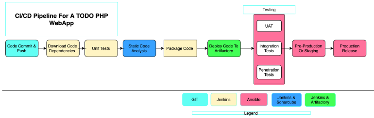
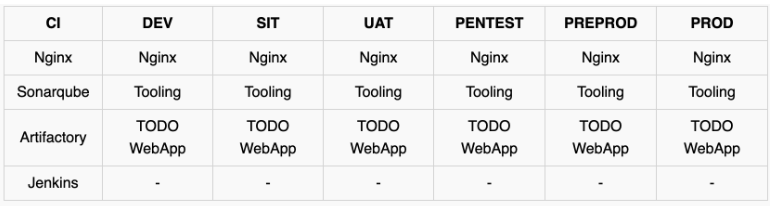

## CONTINUOUS INTEGRATION WITH JENKINS | ANSIBLE | ARTIFACTORY | SONARQUBE | PHP

### INTRODUCTION
This project builds on static and dynamic assignments as portrayed in project 12 and project 13 respectively. The project involves hands-on handling and experience based on the concept of Continuous Integration/ Continuous Deployment from applications perspective. 
Continuous Integration is the practice of merging all developers' copies on a project to a shared  mainline (such as a version control system) several times daily. The general workflow concept of Continuous Integration includes:
* Running tests locally
* Compiling code in CI servers
* Running further tests in CI servers
* Deploying an artifact from CI servers.

Continuous Delivery ensures that software checked into the machine is always ready to be deployed by users. Continuous Deployment is one step ahead and is a fully automatic deployment of softwares to users. Some principles defining a reliable and robust CI/CD pipeline include:
* Maintaining a code repository
* Automate the build process (for applications built on compiled language)
* Keep the build fast
* Test in a clone of production environment
* Automate deployment

The project requires the creation of a pipeline that stimulates continuous integration and delivery. The two (2) Web Applications to be deployed namely: Tooling and TODO applications are based on an interpreted language (PHP). This means that it can be deployed directly onto a server and will work without the need to compile the code to a machine language. Rather than direct deployment from the git repository, we use **Ansible uri module** for application release as this would overcome the dificulty of packaging and versioning the software for different releases.



The figure above describes what we aim to simulate with this project and is a continuation of the previous project. 
The first phase of the project focuses on building these environments:
* Ci
* Dev
* Pentest

The outlay of each environment is as described below:



New files were added to the ansible inventory and it took a new shape:

```
├── ci
├── dev
├── pentest
├── pre-prod
├── prod
├── sit
└── uat
```
The ci inventory file consisted lof the jenkins, nginx, sonarqube and artifact repository private ip-addreses in the format below:
```
[jenkins]
<Jenkins-Private-IP-Address>

[nginx]
<Nginx-Private-IP-Address>

[sonarqube]
<SonarQube-Private-IP-Address>

[artifact_repository]
<Artifact_repository-Private-IP-Address>
``` 

The dev file in the inventory consisted of the tooling webserver, todo webserver, nginx server, database:vars settings and the database private IP-adresses. It is important to note that the path to python interpreter for this is different because it is the only instance tht runs on a Redhat/Centos Linux distro while the others run on the Debian/Ubuntu Linux distro.

```
[tooling]
<Tooling-Web-Server-Private-IP-Address>

[todo]
<Todo-Web-Server-Private-IP-Address>

[nginx]
<Nginx-Private-IP-Address>

[db:vars]
ansible_user=ec2-user
ansible_python_interpreter=/usr/bin/python

[db]
<DB-Server-Private-IP-Address>
```

The pentest inventory file consists of the pentest group with the pentest:children configuration introduced:

```
[pentest:children]
pentest-todo
pentest-tooling

[pentest-todo]
<Pentest-for-Todo-Private-IP-Address>

[pentest-tooling]
<Pentest-for-Tooling-Private-IP-Address>
```

The pentest:children concept stems from **group-vars** where we can declare and set variables for different groups of servers. Hence pentest-tooling and pentest-todo have been grouped under pentest:children. 