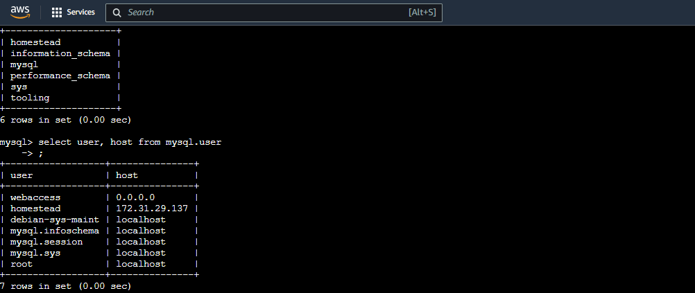
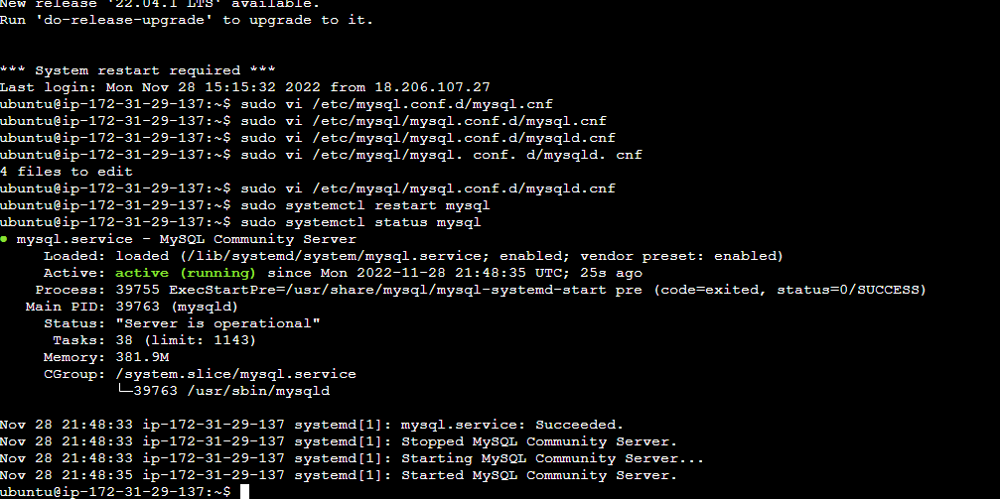

## CONTINUOUS INTEGRATION WITH JENKINS | ANSIBLE | ARTIFACTORY | SONARQUBE | PHP

### INTRODUCTION
This project builds on static and dynamic assignments as portrayed in project 12 and project 13 respectively. The project involves hands-on handling and experience based on the concept of Continuous Integration/ Continuous Deployment from applications perspective. 
Continuous Integration is the practice of merging all developers' copies on a project to a shared  mainline (such as a version control system) several times daily. The general workflow concept of Continuous Integration includes:
* Running tests locally
* Compiling code in CI servers
* Running further tests in CI servers
* Deploying an artifact from CI servers.

Continuous Delivery ensures that software checked into the machine is always ready to be deployed by users. Continuous Deployment is one step ahead and is a fully automatic deployment of softwares to users. Some principles defining a reliable and robust CI/CD pipeline include:
* Maintaining a code repository
* Automate the build process (for applications built on compiled language)
* Keep the build fast
* Test in a clone of production environment
* Automate deployment

The project requires the creation of a pipeline that stimulates continuous integration and delivery. The two (2) Web Applications to be deployed namely: Tooling and TODO applications are based on an interpreted language (PHP). This means that it can be deployed directly onto a server and will work without the need to compile the code to a machine language. Rather than direct deployment from the git repository, we use **Ansible uri module** for application release as this would overcome the dificulty of packaging and versioning the software for different releases.


The figure above describes what we aim to simulate with this project and is a continuation of the previous project. 
The first phase of the project focuses on building these environments:
* Ci
* Dev
* Pentest

The outlay of each environment is as described below:


New files were added to the ansible inventory and it took a new shape:

```
├── ci
├── dev
├── pentest
├── pre-prod
├── prod
├── sit
└── uat
```
The ci inventory file consisted lof the jenkins, nginx, sonarqube and artifact repository private ip-addreses in the format below:
```
[jenkins]
<Jenkins-Private-IP-Address>

[nginx]
<Nginx-Private-IP-Address>

[sonarqube]
<SonarQube-Private-IP-Address>

[artifact_repository]
<Artifact_repository-Private-IP-Address>
``` 

The dev file in the inventory consisted of the tooling webserver, todo webserver, nginx server, database:vars settings and the database private IP-adresses. It is important to note that the path to python interpreter for this is different because it is the only instance tht runs on a Redhat/Centos Linux distro while the others run on the Debian/Ubuntu Linux distro.

```
[tooling]
<Tooling-Web-Server-Private-IP-Address>

[todo]
<Todo-Web-Server-Private-IP-Address>

[nginx]
<Nginx-Private-IP-Address>

[db:vars]
ansible_user=ec2-user
ansible_python_interpreter=/usr/bin/python

[db]
<DB-Server-Private-IP-Address>
```

The pentest inventory file consists of the pentest group with the pentest:children configuration introduced:

```
[pentest:children]
pentest-todo
pentest-tooling

[pentest-todo]
<Pentest-for-Todo-Private-IP-Address>

[pentest-tooling]
<Pentest-for-Tooling-Private-IP-Address>
```

The pentest:children concept stems from **group-vars** where we can declare and set variables for different groups of servers. Hence pentest-tooling and pentest-todo have been grouped under pentest:children. 

SonarQube is an open-source platform developed by SonarSource for continuous inspection pf code quality, used to perform automatic reviews using static analysis to identify bugs, code smells and security vulnerabilities.

Aritfactory is a product of JFrog that serves as a binary repository manager. This functionality makes it an extension to source code repository since it stores the outcome of the build process. It has various automation use-cases, but we would utilize it to build artifacts in this project.

For this project, instead of launching Ansible from the CLI as we have done in previous ones, we launch it from Jenkins. To do this, we need to carry out the following configurations:

**Install & Open Blue Ocean Jenkins Plugin**
* Install Blue Ocean Plugin


* Create a pipeline from the Github repository used in project 13 after generating the required token from github.


After creating the pipeline, we create a Jenkins file inside our directory and defining all steps and actions to be carried out as code.


Inside the Ansible project, we create a new directory called **deploy** and a file called **jenkinsfile** within.


At present, the pipeline consists of only the **Build** stage and we are currently using the **shell script** module to echo the **Building stage**.I added the code snippet below to commence building the jenkinsfile.

```
    pipeline {
  agent any

  stages {
      stage('Build') {
          steps {
            script {
                sh 'echo "Building Stage"'
            }
            }
          }
        }
        }
```

I pushed the current setup to the git repository and the jenkinsfile reflected in the configuration settings on the jenkins server. I edited and included the relative path /delpoy/jenkins file to it.


After applying and saving the configuration, I checked to confirm it was built successfully and checked the Blue Ocean to confirm that it identifies the build stage on the pipeline  


The current platform provides a multi-branch pipeline i.e if there was more than one branch in github, this would be discovered by Jenkins and builds would have been triggered for each branch. In order to see this functionality, I created another branch called feature/jeninspipeline-stages and created a new stage called "Testing stage" by adding extra code with the outcome as shown below:

```
    pipeline {
  agent any

  stages {
      stage('Build') {
          steps {
            script {
                sh 'echo "Building Stage"'
            }
            }
          }

   stage('Test') {
          steps {
            script {
                sh 'echo "Testing Stage"'
            }
            }
          }
        }
        }

```

I pushed the new branch and scanned the repository on the jenkins platform.


I checked the new branch on the pipeline and it reflected an inclusion of the **Test stage** to the pipeline.


I created a pull request to merge the latest code into the main branch.


Afterwards, I pulled the latest change on the main branch from remote to the local repository, checked on Jenkins and the Blue ocean to confirm the pipeline has been updated.


I created a new branch, added more stages to simulate the phases below: 
* Package
* Deploy
* Clean up

```
    pipeline {
  agent any

  stages {
      stage("Initial cleanup") {
          steps {
            dir("${WORKSPACE}") {
              deleteDir()
            }
;          }
        }

      stage('Build') {
          steps {
            script {;
                sh 'echo "Building Stage"'
            }
            }
          }

   stage('Test') {
          steps {
            script {
                sh 'echo "Testing Stage"'
            }
            }
          }

stage('Package') {
          steps {
            script {
                sh 'echo "Package"'
            }
            }
          }

stage('Deploy') {
          steps {
            script {
                sh 'echo "Deploy to Dev"'
;            }
            }
          }

      stage('cleanup Up'){
          steps {
              cleanWs()
            }
            }


        }
        }


```

I verified all the stages are functioning on Blue Ocean on the 


After confirming the successful build of the required stages on jenkins, I merged the feature/jenkinspipeline-stages branch to the main branch.


Next, I install ansible on my jenkins instance as well as the dependencies. THe codes to do this is:

```bash
    yum install python3 python3-pip wget unzip git -y
    python3 -m pip install --upgrade setuptools
    python3 -m pip install --upgrade pip
    python3 -m pip install PyMySQL
    python3 -m pip install mysql-connector-python
    python3 -m pip install psycopg2==2.7.5 --ignore-installed
```

I installed postresql via ansible using:

```bash
    ansbile-galaxy collection install community.postgresql
```

I also downloaded and configured the ansible plugin on the jenkins platform


I created a RedHat instance for nginx instance and Ubuntu instance for the database, set it up


I confirmed that the build with parameters was active


I checked the main branch to confirm success after updated configurations.


I installed the plug and artifactory plugins in jenkins. 


I created an instance for the artifactory server and installed java and artifactory by invoking an ansible playbook via jenkins.


I accessed jfrog, created a local repository and lined it to the jenkins global configuration 


Next, I create a jenkins file in the php-todo repository and typed in the following code snippet:

```
  pipeline {
    agent any

  stages {

     stage("Initial cleanup") {
          steps {
            dir("${WORKSPACE}") {
              deleteDir()
            }
          }
        }

    stage('Checkout SCM') {
      steps {
            git branch: 'main', url: 'https://github.com/darey-devops/php-todo.git'
      }
    }

    stage('Prepare Dependencies') {
      steps {
             sh 'mv .env.sample .env'
             sh 'composer install'
             sh 'php artisan migrate'
             sh 'php artisan db:seed'
             sh 'php artisan key:generate'
      }
    }
  }
}
```

I created a database named **homestead** in the database instance using the ansible playbook ran in the jenkins ci pipeline.

```mysql
    Create database homestead;
CREATE USER 'homestead'@'%' IDENTIFIED BY 'sePret^i';
GRANT ALL PRIVILEGES ON * . * TO 'homestead'@'%';
```


I checked the db instance to confirm that the database was created and the user and host with the database IP in records.






I added the Unit test code snippet to the Jenkinsfile
```
  stage('Execute Unit Tests') {
      steps {
             sh './vendor/bin/phpunit'
      } 
```

For Code Quality Analysis, I made use of phploc for PHP, with the output plotted on graphs in Jenkins. For this, I added the code below in Jenkinsfile:
```
  stage('Code Analysis') {
  steps {
        sh 'phploc app/ --log-csv build/logs/phploc.csv'

    }
  }
```
I plotted the data using the **plot** Jekins plugin which provides generic plotting capabilities in Jenkins that allows for plotting of more single values variations across builds in one or more plots. PLots for a project are configured in the job configuration screen. After each build is completed, the plots data series latest values are pulled from the CSV file generated by php;oc. The code used is shown below:
```
  stage('Plot Code Coverage Report') {
      steps {

            plot csvFileName: 'plot-396c4a6b-b573-41e5-85d8-73613b2ffffb.csv', csvSeries: [[displayTableFlag: false, exclusionValues: 'Lines of Code (LOC),Comment Lines of Code (CLOC),Non-Comment Lines of Code (NCLOC),Logical Lines of Code (LLOC)                          ', file: 'build/logs/phploc.csv', inclusionFlag: 'INCLUDE_BY_STRING', url: '']], group: 'phploc', numBuilds: '100', style: 'line', title: 'A - Lines of code', yaxis: 'Lines of Code'
            plot csvFileName: 'plot-396c4a6b-b573-41e5-85d8-73613b2ffffb.csv', csvSeries: [[displayTableFlag: false, exclusionValues: 'Directories,Files,Namespaces', file: 'build/logs/phploc.csv', inclusionFlag: 'INCLUDE_BY_STRING', url: '']], group: 'phploc', numBuilds: '100', style: 'line', title: 'B - Structures Containers', yaxis: 'Count'
            plot csvFileName: 'plot-396c4a6b-b573-41e5-85d8-73613b2ffffb.csv', csvSeries: [[displayTableFlag: false, exclusionValues: 'Average Class Length (LLOC),Average Method Length (LLOC),Average Function Length (LLOC)', file: 'build/logs/phploc.csv', inclusionFlag: 'INCLUDE_BY_STRING', url: '']], group: 'phploc', numBuilds: '100', style: 'line', title: 'C - Average Length', yaxis: 'Average Lines of Code'
            plot csvFileName: 'plot-396c4a6b-b573-41e5-85d8-73613b2ffffb.csv', csvSeries: [[displayTableFlag: false, exclusionValues: 'Cyclomatic Complexity / Lines of Code,Cyclomatic Complexity / Number of Methods ', file: 'build/logs/phploc.csv', inclusionFlag: 'INCLUDE_BY_STRING', url: '']], group: 'phploc', numBuilds: '100', style: 'line', title: 'D - Relative Cyclomatic Complexity', yaxis: 'Cyclomatic Complexity by Structure'      
            plot csvFileName: 'plot-396c4a6b-b573-41e5-85d8-73613b2ffffb.csv', csvSeries: [[displayTableFlag: false, exclusionValues: 'Classes,Abstract Classes,Concrete Classes', file: 'build/logs/phploc.csv', inclusionFlag: 'INCLUDE_BY_STRING', url: '']], group: 'phploc', numBuilds: '100', style: 'line', title: 'E - Types of Classes', yaxis: 'Count'
            plot csvFileName: 'plot-396c4a6b-b573-41e5-85d8-73613b2ffffb.csv', csvSeries: [[displayTableFlag: false, exclusionValues: 'Methods,Non-Static Methods,Static Methods,Public Methods,Non-Public Methods', file: 'build/logs/phploc.csv', inclusionFlag: 'INCLUDE_BY_STRING', url: '']], group: 'phploc', numBuilds: '100', style: 'line', title: 'F - Types of Methods', yaxis: 'Count'
            plot csvFileName: 'plot-396c4a6b-b573-41e5-85d8-73613b2ffffb.csv', csvSeries: [[displayTableFlag: false, exclusionValues: 'Constants,Global Constants,Class Constants', file: 'build/logs/phploc.csv', inclusionFlag: 'INCLUDE_BY_STRING', url: '']], group: 'phploc', numBuilds: '100', style: 'line', title: 'G - Types of Constants', yaxis: 'Count'
            plot csvFileName: 'plot-396c4a6b-b573-41e5-85d8-73613b2ffffb.csv', csvSeries: [[displayTableFlag: false, exclusionValues: 'Test Classes,Test Methods', file: 'build/logs/phploc.csv', inclusionFlag: 'INCLUDE_BY_STRING', url: '']], group: 'phploc', numBuilds: '100', style: 'line', title: 'I - Testing', yaxis: 'Count'
            plot csvFileName: 'plot-396c4a6b-b573-41e5-85d8-73613b2ffffb.csv', csvSeries: [[displayTableFlag: false, exclusionValues: 'Logical Lines of Code (LLOC),Classes Length (LLOC),Functions Length (LLOC),LLOC outside functions or classes ', file: 'build/logs/phploc.csv', inclusionFlag: 'INCLUDE_BY_STRING', url: '']], group: 'phploc', numBuilds: '100', style: 'line', title: 'AB - Code Structure by Logical Lines of Code', yaxis: 'Logical Lines of Code'
            plot csvFileName: 'plot-396c4a6b-b573-41e5-85d8-73613b2ffffb.csv', csvSeries: [[displayTableFlag: false, exclusionValues: 'Functions,Named Functions,Anonymous Functions', file: 'build/logs/phploc.csv', inclusionFlag: 'INCLUDE_BY_STRING', url: '']], group: 'phploc', numBuilds: '100', style: 'line', title: 'H - Types of Functions', yaxis: 'Count'
            plot csvFileName: 'plot-396c4a6b-b573-41e5-85d8-73613b2ffffb.csv', csvSeries: [[displayTableFlag: false, exclusionValues: 'Interfaces,Traits,Classes,Methods,Functions,Constants', file: 'build/logs/phploc.csv', inclusionFlag: 'INCLUDE_BY_STRING', url: '']], group: 'phploc', numBuilds: '100', style: 'line', title: 'BB - Structure Objects', yaxis: 'Count'

      }
    }
```
I bundled the application code into an artifact upload to artifactory:
```
stage ('Package Artifact') {
    steps {
            sh 'zip -qr php-todo.zip ${WORKSPACE}/*'
     }
    } 
```
I published the resulting artifact into artifactory
```
stage ('Upload Artifact to Artifactory') {
          steps {
            script { 
                 def server = Artifactory.server 'artifactory-server'                 
                 def uploadSpec = """{
                    "files": [
                      {
                       "pattern": "php-todo.zip",
                       "target": "<name-of-artifact-repository>/php-todo",
                       "props": "type=zip;status=ready"

                       }
                    ]
                 }""" 

                 server.upload spec: uploadSpec
               }
            }

        }
```
I deployed the application to the dev environment by launching Ansiible pipeline. 

```
  stage ('Deploy to Dev Environment') {
    steps {
    build job: 'ansible-project/main', parameters: [[$class: 'StringParameterValue', name: 'env', value: 'dev']], propagate: false, wait: true
    }
  }
```

We configured **SonarQube**, an open-source platform for continuous inspection of code quality to perform automatic reviews with static bug detecting analysis. 

I created an ubuntu instance for the SonarQube. I tuned the Linux Kernel by making session changes that doesnt persist beyond the current session terminal:
```
  sudo sysctl -w vm.max_map_count=262144
sudo sysctl -w fs.file-max=65536
ulimit -n 65536
ulimit -u 4096
```
I edited the /etc/security/limits.conf file and appended the following:
```
  sonarqube   -   nofile   65536
  sonarqube   -   nproc  ;  4096
```

I updated and upgraded the system packages:
```
  sudo apt-get update
  sudo apt-get upgrade
```

I installed and unzipped the wget package
```
  sudo apt-get install wget unzip -y
```

I installed OpenJDK and Java RUntime Environment (JRE)11
```
  sudo apt-get install openjdk-11-jdk -y
  sudo apt-get install openjdk-11-jre -y
```

I set the default JDK or switch to OpenJDK and enter the command:
```
  sudo update-alternatives --config java
```

I verified the JAVA version.

To install and setup PostgreSQL 10 database for SonarQube, I added the PostgreSQL repo to the repo list:
```
  sudo sh -c 'echo "deb http://apt.postgresql.org/pub/repos/apt/ `lsb_release -cs`-pgdg main" >> /etc/apt/sources.list.d/pgdg.list'
```

I downloaded PostgreSQL software:
```
  wget -q https://www.postgresql.org/media/keys/ACCC4CF8.asc -O - | sudo apt-key add -
```

I installed PostgreSQL Database Server:
```
  sudo apt-get -y install postgresql postgresql-contrib
```

I started and enabled PosrgreSQL Database server
and set the password for default postgres user.
```
  sudo passwd postgres
  su - postgres
  createuser sonar
  psql
```

I  set a password for the newly created user for SonarQube database:
```
  ALTER USER sonar WITH ENCRYPTED password 'sonar';
  CREATE DATABASE sonarqube OWNER sonar;
  grant all privileges on DATABASE sonarqube to sonar;
  \q
  exit
```

I navigated to the tmp directory and temporarily downloaded the installation files:
```
  cd /tmp && sudo wget https://binaries.sonarsource.com/Distribution/sonarqube/sonarqube-7.9.3.zip
```

I unzipped the archive setup to /opt directory
```
  sudo unzip sonarqube-7.9.3.zip -d /opt
```
I moved extracted setup to /opt/sonarqube directory
```
  sudo mv /opt/sonarqube-7.9.3 /opt/sonarqube
```
I created a group and user to run SOnarQube:
```
  sudo groupadd sonar
  sudo useradd -c "user to run SonarQube" -d /opt/sonarqube -g sonar sonar
  sudo chown sonar:sonar /opt/sonarqube -R
```
I edited the /opt/sonarqube/conf/sonar.properties and included the following details:
#sonar.jdbc.username=sonar
#sonar.jdbc.password=sonar
sonar.jdbc.url=jdbc:postgresql://localhost:5432/sonarqube

I edited the /opt/sonarqube/bin/linux-x86-64/sonar.sh and set RUN_AS_USER=sonar .I switched to sonar user and moved to the script directory, and ran the script to start the SonarQube.
```
  sudo su sonar
  cd /opt/sonarqube/bin/linux-x86-64/
  ./sonar.sh start
```
I checked the SonarQube log file to confirm it was running:

```
  tail /opt/sonarqube/logs/sonar.log
```

I configures SonarQube to run as a systemd service after stopping the current running service:
```
  cd /opt/sonarqube/bin/linux-x86-64/
  ./sonar.sh stop
```
I created a systemd service file for SonarQube to run as system startup at **/etc/systemd/system/sonar.service** using the following code snippet:
```
  [Unit]
Description=SonarQube service
After=syslog.target network.target

[Service]
Type=forking

ExecStart=/opt/sonarqube/bin/linux-x86-64/sonar.sh start
ExecStop=/opt/sonarqube/bin/linux-x86-64/sonar.sh stop

User=sonar
Group=sonar
Restart=always

LimitNOFILE=65536
LimitNPROC=4096

[Install]
WantedBy=multi-user.target
```

I controlled the SonarQube service using systemctl

```
  sudo systemctl start sonar
  sudo systemctl enable sonar
  sudo systemctl status sonar
```

Afterwards, I logged in to sonarqube with adminstrator username and password.

I installed the SonarScanner plugin on Jenkins and added the SonarQube server. I generated the authentication token in SonarQube and configured quality gate jenkins hook in SonarQube with the url pointing to Jenkins server at 
http://{JENKINS_HOST}/sonarqube-webhook/
via the Administration > Configuration > Webhooks > Create path.

I setup the SonarQube scanner from Jenkins via 
manage Jenkins > Global Tool COnfiguration

and updated Jenkins Pipeline to include SonarQube scanning and Qualitty Gate by including the following snippet of code to the jenkinsfile:
```
  stage('SonarQube Quality Gate') {
        environment {
            scannerHome = tool 'SonarQubeScanner'
        }
        steps {
            withSonarQubeEnv('sonarqube') {
                sh "${scannerHome}/bin/sonar-scanner"
            }

        }
    }
```

Prior to the preceding step, I setup the sonar-scanner properties by following the SonarQube configuration page on the platform by accessing the tools directory on the server to setup the required properties 
```
  cd /var/lib/jenkins/tools/hudson.plugins.sonar.SonarRunnerInstallation/SonarQubeScanner/conf/
  sudo vi sonar-scanner.properties
```
In the sonar-scanner,properties file , I included the following lines of code to include php-todo project:
```
sonar.host.url=http://<SonarQube-Server-IP-address>:9000
sonar.projectKey=php-todo
#----- Default source code encoding
sonar.sourceEncoding=UTF-8
sonar.php.exclusions=**/vendor/**
sonar.php.coverage.reportPaths=build/logs/clover.xml
sonar.php.tests.reportPath=build/logs/junit.xml
```
I examined the scanner tool configuration on the jenkins server in the tools directory.

```
/var/lib/jenkins/tools/hudson.plugins.sonar.SonarRunnerInstallation/SonarQubeScanner/bin$ ls -latr
```

I generated the jenkins code from the SonarQube via  Dashboard > php-todo > Pipeline Syntax, clicked on the sample steps selected "withSonarQubeEnv and Generate Pipeline Script. this was included in the jenkinsfile code snippet and the pipeline deployed succesfully.

I navigated to the php-todo project in SonarQube User Interface to examine the coe quality deployed in the dev environment.


