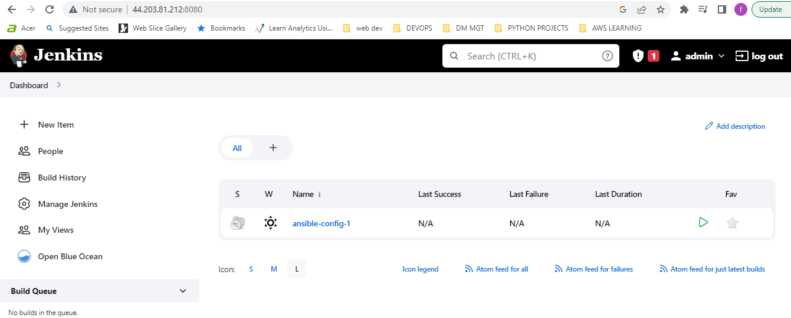

## CONTINUOUS INTEGRATION WITH JENKINS | ANSIBLE | ARTIFACTORY | SONARQUBE | PHP

### INTRODUCTION
This project builds on static and dynamic assignments as portrayed in project 12 and project 13 respectively. The project involves hands-on handling and experience based on the concept of Continuous Integration/ Continuous Deployment from applications perspective. 
Continuous Integration is the practice of merging all developers' copies on a project to a shared  mainline (such as a version control system) several times daily. The general workflow concept of Continuous Integration includes:
* Running tests locally
* Compiling code in CI servers
* Running further tests in CI servers
* Deploying an artifact from CI servers.

Continuous Delivery ensures that software checked into the machine is always ready to be deployed by users. Continuous Deployment is one step ahead and is a fully automatic deployment of softwares to users. Some principles defining a reliable and robust CI/CD pipeline include:
* Maintaining a code repository
* Automate the build process (for applications built on compiled language)
* Keep the build fast
* Test in a clone of production environment
* Automate deployment

The project requires the creation of a pipeline that stimulates continuous integration and delivery. The two (2) Web Applications to be deployed namely: Tooling and TODO applications are based on an interpreted language (PHP). This means that it can be deployed directly onto a server and will work without the need to compile the code to a machine language. Rather than direct deployment from the git repository, we use **Ansible uri module** for application release as this would overcome the dificulty of packaging and versioning the software for different releases.


The figure above describes what we aim to simulate with this project and is a continuation of the previous project. 
The first phase of the project focuses on building these environments:
* Ci
* Dev
* Pentest

The outlay of each environment is as described below:


New files were added to the ansible inventory and it took a new shape:

```
├── ci
├── dev
├── pentest
├── pre-prod
├── prod
├── sit
└── uat
```
The ci inventory file consisted lof the jenkins, nginx, sonarqube and artifact repository private ip-addreses in the format below:
```
[jenkins]
<Jenkins-Private-IP-Address>

[nginx]
<Nginx-Private-IP-Address>

[sonarqube]
<SonarQube-Private-IP-Address>

[artifact_repository]
<Artifact_repository-Private-IP-Address>
``` 

The dev file in the inventory consisted of the tooling webserver, todo webserver, nginx server, database:vars settings and the database private IP-adresses. It is important to note that the path to python interpreter for this is different because it is the only instance tht runs on a Redhat/Centos Linux distro while the others run on the Debian/Ubuntu Linux distro.

```
[tooling]
<Tooling-Web-Server-Private-IP-Address>

[todo]
<Todo-Web-Server-Private-IP-Address>

[nginx]
<Nginx-Private-IP-Address>

[db:vars]
ansible_user=ec2-user
ansible_python_interpreter=/usr/bin/python

[db]
<DB-Server-Private-IP-Address>
```

The pentest inventory file consists of the pentest group with the pentest:children configuration introduced:

```
[pentest:children]
pentest-todo
pentest-tooling

[pentest-todo]
<Pentest-for-Todo-Private-IP-Address>

[pentest-tooling]
<Pentest-for-Tooling-Private-IP-Address>
```

The pentest:children concept stems from **group-vars** where we can declare and set variables for different groups of servers. Hence pentest-tooling and pentest-todo have been grouped under pentest:children. 

SonarQube is an open-source platform developed by SonarSource for continuous inspection pf code quality, used to perform automatic reviews using static analysis to identify bugs, code smells and security vulnerabilities.

Aritfactory is a product of JFrog that serves as a binary repository manager. This functionality makes it an extension to source code repository since it stores the outcome of the build process. It has various automation use-cases, but we would utilize it to build artifacts in this project.

For this project, instead of launching Ansible from the CLI as we have done in previous ones, we launch it from Jenkins. To do this, we need to carry out the following configurations:

**Install & Open Blue Ocean Jenkins Plugin**
* Install Blue Ocean Plugin


* Create a pipeline from the Github repository used in project 13 after generating the required token from github.


After creating the pipeline, we create a Jenkins file inside our directory and defining all steps and actions to be carried out as code.



Inside the Ansible project, we create a new directory called **deploy** and a file called **jenkinsfile** within.


At present, the pipeline consists of only the **Build** stage and we are currently using the **shell script** module to echo the **Building stage**.I added the code snippet below to commence building the jenkinsfile.

```
    pipeline {
  agent any

  stages {
      stage('Build') {
          steps {
            script {
                sh 'echo "Building Stage"'
            }
            }
          }
        }
        }
```

I pushed the current setup to the git repository and the jenkinsfile reflected in the configuration settings on the jenkins server. I edited and included the relative path /delpoy/jenkins file to it.


After applying and saving the configuration, I checked to confirm it was built successfully and checked the Blue Ocean to confirm that it identifies the build stage on the pipeline  


The current platform provides a multi-branch pipeline i.e if there was more than one branch in github, this would be discovered by Jenkins and builds would have been triggered for each branch. In order to see this functionality, I created another branch called feature/jeninspipeline-stages and created a new stage called "Testing stage" by adding extra code with the outcome as shown below:

```
    pipeline {
  agent any

  stages {
      stage('Build') {
          steps {
            script {
                sh 'echo "Building Stage"'
            }
            }
          }

   stage('Test') {
          steps {
            script {
                sh 'echo "Testing Stage"'
            }
            }
          }
        }
        }

```

I pushed the new branch and scanned the repository on the jenkins platform.


I checked the new branch on the pipeline and it reflected an inclusion of the **Test stage** to the pipeline.


I created a pull request to merge the latest code into the main branch.


Afterwards, I pulled the latest change on the main branch from remote to the local repository, checked on Jenkins and the Blue ocean to confirm the pipeline has been updated.


I created a new branch, added more stages to simulate the phases below: 
* Package
* Deploy
* Clean up

```
    pipeline {
  agent any

  stages {
      stage("Initial cleanup") {
          steps {
            dir("${WORKSPACE}") {
              deleteDir()
            }
;          }
        }

      stage('Build') {
          steps {
            script {;
                sh 'echo "Building Stage"'
            }
            }
          }

   stage('Test') {
          steps {
            script {
                sh 'echo "Testing Stage"'
            }
            }
          }

stage('Package') {
          steps {
            script {
                sh 'echo "Package"'
            }
            }
          }

stage('Deploy') {
          steps {
            script {
                sh 'echo "Deploy to Dev"'
;            }
            }
          }

      stage('cleanup Up'){
          steps {
              cleanWs()
            }
            }


        }
        }


```

I verified all the stages are functioning on Blue Ocean on the 


After confirming the successful build of the required stages on jenkins, I merged the feature/jenkinspipeline-stages branch to the main branch.


Next, I install ansible on my jenkins instance as well as the dependencies. THe codes to do this is:

```bash
    yum install python3 python3-pip wget unzip git -y
    python3 -m pip install --upgrade setuptools
    python3 -m pip install --upgrade pip
    python3 -m pip install PyMySQL
    python3 -m pip install mysql-connector-python
    python3 -m pip install psycopg2==2.7.5 --ignore-installed
```

I installed postresql via ansible using:

```bash
    ansbile-galaxy collection install community.postgresql
```

I also downloaded and configured the ansible plugin on the jenkins platform


I created a RedHat instance for nginx instance and Ubuntu instance for the database, set it up


I confirmed that the build with parameters was active


I checked the main branch to confirm success after updated configurations.


I installed the plug and artifactory plugins in jenkins. 


I created an instance for the artifactory server and installed java and artifactory by invoking an ansible playbook via jenkins.


I accessed jfrog, created a local repository and lined it to the jenkins global configuration 


Next, I create a jenkins file in the php-todo repository and typed in the following code snippet:

```
  pipeline {
    agent any

  stages {

     stage("Initial cleanup") {
          steps {
            dir("${WORKSPACE}") {
              deleteDir()
            }
          }
        }

    stage('Checkout SCM') {
      steps {
            git branch: 'main', url: 'https://github.com/darey-devops/php-todo.git'
      }
    }

    stage('Prepare Dependencies') {
      steps {
             sh 'mv .env.sample .env'
             sh 'composer install'
             sh 'php artisan migrate'
             sh 'php artisan db:seed'
             sh 'php artisan key:generate'
      }
    }
  }
}
```

I created a database named **homestead** in the database instance using the ansible playbook ran in the jenkins ci pipeline.


I checked the db instance to confirm that the database was created.


